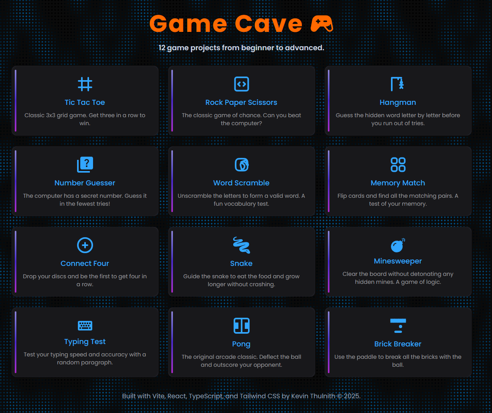

[](#)
[](#)
[](#)
[](#)
[](#)
[](#)
[](#)

# Game Cave 🎮

A collection of classic game projects developed with **Vite | React | Tailwind CSS and TypeScript** with **Server-Side Rendering (SSR)**. 🚀 **[Live Demo on Vercel](https://game-cave-mu.vercel.app/)** | 📱 **Mobile Friendly** | ⚡ **Lightning Fast** | 🐳 **Docker Ready** | 🔄 **SSR Enabled**



---

## 🎯 Featured Games

<div align="center">

| 🧱 **Classic Arcade** | 🧩 **Strategy & Logic** |   🎲 **Casual Fun**    |
| :-------------------: | :---------------------: | :--------------------: |
|   🧱 Brick Breaker    |     🔴 Connect Four     |   🎯 Number Guesser    |
|       🐍 Snake        |     🎯 Tic Tac Toe      | 🪨 Rock Paper Scissors |
|        🏓 Pong        |     💣 Minesweeper      |    🔤 Word Scramble    |
|                       |     🧠 Memory Match     |     ⚡ Typing Test     |
|                       |       🎪 Hangman        |                        |

</div>

### 🌟 Game Highlights

- **🧱 Brick Breaker** - Classic arcade action with paddle and ball physics
- **🐍 Snake** - Navigate the snake to collect food and grow longer
- **🔴 Connect Four** - Strategic gameplay to connect four pieces in a row
- **💣 Minesweeper** - Clear the minefield using logic and deduction
- **🧠 Memory Match** - Test your memory with card matching gameplay
- **🏓 Pong** - The original tennis-style arcade game
- **🎯 Tic Tac Toe** - Classic 3x3 grid strategy game
- **🎪 Hangman** - Guess the word before the drawing is complete
- **🎯 Number Guesser** - Challenge your intuition with number guessing
- **🪨 Rock Paper Scissors** - The timeless hand game
- **⚡ Typing Test** - Improve your typing speed and accuracy
- **🔤 Word Scramble** - Unscramble letters to form words

---

## ✨ Key Features

- 🎮 **12 Classic Games** - A diverse collection of timeless games
- 📱 **Responsive Design** - Perfect on desktop, tablet, and mobile
- ⚡ **Lightning Fast** - Built with Vite for optimal performance
- 🎨 **Modern UI** - Clean, intuitive interface with TailwindCSS
- 🔧 **Type Safe** - Written in TypeScript for reliability
- � **Server-Side Rendering (SSR)** - Faster initial page loads and better SEO
- �🐳 **Docker Ready** - Containerized deployment for any environment
- 🌐 **Multi-Platform Deploy** - Vercel, Docker, or cloud platforms
- 🎯 **PWA Ready** - Can be installed as a Progressive Web App
- 🔄 **State Management** - Smooth game state handling
- 🎵 **Sound Effects** - Immersive audio feedback (coming soon)
- 🏆 **Score Tracking** - Keep track of your best performances

---

## 🚀 Quick Start

Choose your preferred setup method:

### 🏃‍♂️ **Local Development** (Recommended for development)

- Standard npm setup with hot reload
- Perfect for development and customization

### 🐳 **Docker Deployment** (Recommended for consistency)

- Containerized environment
- Works identically across all platforms
- Great for teams and production

### 🌐 **Cloud Deployment** (Recommended for production)

- One-click deploy to Vercel
- Instant global CDN distribution

---

### 📦 Installation

1. **Clone the repository:**

   ```bash
   git clone https://github.com/kevinThulnith/game-cave.git
   ```

2. **Navigate to the frontend directory:**

   ```bash
   cd javascript-games/frontend
   ```

3. **Install dependencies:**

   ```bash
   npm i
   ```

4. **Set up environment variables (optional):**

   Create a `.env` file in the frontend directory:

   ```bash
   # In the frontend directory
   touch .env
   ```

   Add the following environment variables to your `.env` file:

   ```env
   # Optional: Gemini API Key for future AI features
   GEMINI_API_KEY=your_gemini_api_key_here
   ```

   > **Note:** The GEMINI_API_KEY is currently set up for potential future AI-powered features but is not required for basic gameplay. You can obtain a free API key from [Google AI Studio](https://aistudio.google.com/app/apikey) if you plan to extend the games with AI functionality.

 <br>

### 🎮 Running the Games

#### Development Mode

```bash
npm run dev
```

- Starts the development server at `http://localhost:5173/`\_

#### Production Build

```bash
npm run build
```

- Creates an optimized production build with SSR support\_

#### Server-Side Rendering (SSR) Mode

```bash
npm run serve
```

- Runs the production build with SSR for better SEO and faster initial loads\_

#### Preview Build

```bash
npm run preview
```

- Preview the production build locally\_

#### Network Access

```bash
npm run host
```

_Run on your local network for testing on multiple devices_

---

## 🌐 Deployment

### Deploy to Vercel

The easiest way to deploy your Game Cave is using [Vercel](https://vercel.com/):

1. **One-Click Deploy:**

   [](https://vercel.com/new/clone?repository-url=https://github.com/kevinThulnith/game-cave)

2. **Manual Deployment:**

   ```bash
   # Install Vercel CLI
   npm i -g vercel

   # Deploy from the frontend directory
   cd frontend
   vercel
   ```

3. **GitHub Integration:**
   - Connect your repository to Vercel
   - Automatic deployments on every push to main branch
   - Preview deployments for pull requests

### Build Configuration

For Vercel deployment, make sure your build settings are:

- **Build Command:** `npm run build`
- **Output Directory:** `dist`
- **Install Command:** `npm install`
- **Root Directory:** `frontend`

### Environment Variables

For basic gameplay, no environment variables are required - the games run entirely on the client side! However, if you want to set up the project for future AI-powered features:

1. **Create a `.env` file in the frontend directory:**

   ```bash
   cd frontend
   touch .env  # On Windows: type nul > .env
   ```

2. **Add the following variables:**

   ```env
   # Optional: For future AI-powered game features
   GEMINI_API_KEY=your_gemini_api_key_here
   ```

3. **Get your Gemini API Key (optional):**
   - Visit [Google AI Studio](https://aistudio.google.com/app/apikey)
   - Create a new API key
   - Replace `your_gemini_api_key_here` with your actual key

> **Important:** Never commit your `.env` file to version control. The `.env` file is already included in `.gitignore` for your security.

---

## 🐳 Docker Deployment

Containerize Game Cave with Docker for consistent deployment across any environment! Perfect for development, testing, and production deployments.

### 📋 Prerequisites

Ensure Docker is installed on your system:

```bash
# Check if Docker is installed
docker --version

# Check if Docker Compose is available
docker compose version
```

> **Need Docker?** Download from [docker.com](https://www.docker.com/products/docker-desktop) - Available for Windows, macOS, and Linux

### 🚀 Quick Start with Docker

#### Method 1: Direct Docker Build & Run

1. **Navigate to the frontend directory:**

   ```bash
   cd frontend
   ```

2. **Build the Docker image:**

   ```bash
   # Development build
   docker build -t game-cave:dev .

   # Production build (coming soon)
   docker build -f Dockerfile.prod -t game-cave:prod .
   ```

3. **Verify the image was created:**

   ```bash
   docker images | grep game-cave
   ```

4. **Run the container:**

   ```bash
   # Development mode with hot reload
   docker run -p 5173:5173 -v "$(pwd):/app" -v /app/node_modules --name game-cave-dev game-cave:dev

   # Simple run (no hot reload)
   docker run -p 5173:5173 --name game-cave-dev game-cave:dev

   # Run
   docker run -p 5173:5173 game-cave:dev
   ```

5. **Access your games:**
   - 🌐 **Local:** http://localhost:5173
   - 📱 **Network:** http://your-ip-address:5173

#### Method 2: Docker Compose (Recommended)

```bash
# Navigate to frontend directory
cd frontend

# Start the application with Docker Compose
docker compose up -d

# View logs
docker compose logs -f

# Stop the application
docker compose down
```

### 🛠️ Docker Commands Cheat Sheet

| Command                                 | Description             |
| --------------------------------------- | ----------------------- |
| `docker build -t game-cave:dev .`       | Build development image |
| `docker run -p 5173:5173 game-cave:dev` | Run container           |
| `docker ps`                             | List running containers |
| `docker stop game-cave-dev`             | Stop container          |
| `docker rm game-cave-dev`               | Remove container        |
| `docker rmi game-cave:dev`              | Remove image            |
| `docker logs game-cave-dev`             | View container logs     |

### 🔧 Advanced Configuration

#### Environment Variables

```bash
# Run with custom environment variables
docker run -p 5173:5173 \
  -e NODE_ENV=development \
  -e VITE_API_URL=http://localhost:3000 \
  --name game-cave-dev \
  game-cave:dev
```

#### Volume Mounting for Development

```bash
# Mount source code for hot reload during development
docker run -p 5173:5173 \
  -v "$(pwd):/app" \
  -v /app/node_modules \
  --name game-cave-dev \
  game-cave:dev
```

#### Multi-Stage Production Build

```dockerfile
# Example production Dockerfile (Dockerfile.prod)
FROM node:22-alpine AS builder
WORKDIR /app
COPY package*.json ./
RUN npm ci --only=production
COPY . .
RUN npm run build

FROM nginx:alpine AS production
COPY --from=builder /app/dist /usr/share/nginx/html
COPY nginx.conf /etc/nginx/nginx.conf
EXPOSE 80
CMD ["nginx", "-g", "daemon off;"]
```

### 🌐 Network Access & Mobile Testing

```bash
# Run on all interfaces for network access
docker run -p 0.0.0.0:5173:5173 --name game-cave-dev game-cave:dev

# Find your IP address
# Windows PowerShell:
ipconfig | findstr IPv4
# macOS/Linux:
ifconfig | grep inet
```

Now you can test on mobile devices using `http://your-ip:5173`

### 🐛 Troubleshooting

#### Common Issues & Solutions

| Issue                 | Solution                                                        |
| --------------------- | --------------------------------------------------------------- |
| Port already in use   | Use different port: `-p 3000:5173`                              |
| Permission denied     | Run with `sudo` (Linux/macOS) or check Docker Desktop (Windows) |
| Image not found       | Rebuild image: `docker build -t game-cave:dev .`                |
| Container won't start | Check logs: `docker logs game-cave-dev`                         |

#### Clean Slate Reset

```bash
# Stop and remove all Game Cave containers
docker stop $(docker ps -q --filter ancestor=game-cave:dev)
docker rm $(docker ps -aq --filter ancestor=game-cave:dev)

# Remove all Game Cave images
docker rmi $(docker images game-cave -q)

# Clean up unused Docker resources
docker system prune -af
```

### 🚢 Production Deployment

#### Docker Hub Deployment

```bash
# Tag your image
docker tag game-cave:dev yourusername/game-cave:latest

# Push to Docker Hub
docker push yourusername/game-cave:latest

# Deploy anywhere
docker run -p 80:80 yourusername/game-cave:latest
```

#### Cloud Deployment Options

- **🌊 DigitalOcean App Platform** - One-click Docker deployment
- **☁️ AWS ECS/Fargate** - Scalable container orchestration
- **🔵 Azure Container Instances** - Serverless containers
- **🌐 Google Cloud Run** - Pay-per-use container platform

### 📊 Container Health & Monitoring

```bash
# Monitor container resources
docker stats game-cave-dev

# Health check
docker exec game-cave-dev curl -f http://localhost:5173 || exit 1

# Container shell access
docker exec -it game-cave-dev sh
```

### 🎯 Why Docker for Game Cave?

- ✅ **Consistent Environment** - Same setup across all machines
- ✅ **Quick Setup** - Get running in minutes, not hours
- ✅ **Isolated Dependencies** - No conflicts with system packages
- ✅ **Easy Cleanup** - Remove everything with one command
- ✅ **Production Ready** - Scale from dev to production seamlessly
- ✅ **Team Collaboration** - Everyone runs the same environment

---

## 🛠️ Tech Stack

### Frontend Technologies

- **⚛️ React 19** - Modern UI library with hooks and functional components
- **📘 TypeScript** - Type-safe JavaScript for better development experience
- **⚡ Vite** - Lightning-fast build tool and development server with SSR support
- **🎨 TailwindCSS** - Utility-first CSS framework for rapid UI development
- **🔧 ESLint** - Code linting for maintaining code quality
- **🔄 Express.js** - Server-side rendering and API handling

### Deployment & DevOps

- **🐳 Docker** - Containerization for consistent deployments
- **🌐 Vercel** - Serverless deployment platform
- **☁️ Multi-Cloud Ready** - AWS, Azure, Google Cloud, DigitalOcean

---

## 🤝 Contributing

We welcome contributions! Here's how you can help:

1. 🍴 Fork the repository
2. 🌿 Create a feature branch (`git checkout -b feature/amazing-game`)
3. 💝 Commit your changes (`git commit -m 'Add some amazing game'`)
4. 📤 Push to the branch (`git push origin feature/amazing-game`)
5. 🎉 Open a Pull Request

---

## 📄 License

This project is licensed under the MIT License - see the [LICENSE](LICENSE) file for details.

---

## 🙏 Acknowledgments

- 🎮 Inspired by classic arcade and casual games
- ⚡ Built with modern web technologies for the best user experience
- 🌐 Deployed on Vercel for blazing-fast global delivery
- 🙏 Thanks to all contributors who help make this project better!
- 💡 Special thanks to the React, TypeScript, and Vite communities

---

## 📊 Project Stats

- 🎯 **12 Games** implemented and ready to play
- 📦 **Lightweight Bundle** - Optimized for fast loading
- 🌍 **Global CDN** - Fast delivery worldwide via Vercel
- 📱 **Mobile Optimized** - Works perfectly on all devices
- ⚡ **< 3s Load Time** - Lightning-fast performance
- 🐳 **Docker Ready** - Container support for all environments
- ☁️ **Multi-Cloud** - Deploy anywhere with Docker containers

---

<div align="center">

**⭐ Don't forget to star this repository if you enjoyed the games! ⭐**

Made with ❤️ by [Kevin Thulnith](https://github.com/kevinThulnith)

</div>
