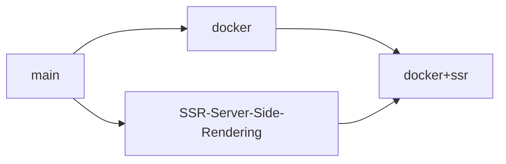

[](#)
[](#)
[](#)
[](#)
[](#)
[](#)
[](#)


# Game Cave 🎮

A collection of classic game projects developed with **Vite | React | Tailwind CSS and TypeScript** with **Server-Side Rendering (SSR)** and **Google Gemini AI Integration**. 🚀 **[Live Demo on Vercel](https://multi-stage-react-project.vercel.app/)** | 📱 **Mobile Friendly** | ⚡ **Lightning Fast** | 🐳 **Docker Ready** | 🔄 **SSR Enabled** | 🤖 **AI-Powered Features**


---

## 🎯 Featured Games

<div align="center">

| 🧱 **Classic Arcade** | 🧩 **Strategy & Logic** |   🎲 **Casual Fun**    |
| :-------------------: | :---------------------: | :--------------------: |
|   🧱 Brick Breaker    |     🔴 Connect Four     |   🎯 Number Guesser    |
|       🐍 Snake        |     🎯 Tic Tac Toe      | 🪨 Rock Paper Scissors |
|        🏓 Pong        |     💣 Minesweeper      |    🔤 Word Scramble    |
|                       |     🧠 Memory Match     |     ⚡ Typing Test     |
|                       |       🎪 Hangman        |                        |

</div>

### 🌟 Game Highlights

- **🧱 Brick Breaker** - Classic arcade action with paddle and ball physics
- **🐍 Snake** - Navigate the snake to collect food and grow longer
- **🔴 Connect Four** - Strategic gameplay to connect four pieces in a row
- **💣 Minesweeper** - Clear the minefield using logic and deduction
- **🧠 Memory Match** - Test your memory with card matching gameplay
- **🏓 Pong** - The original tennis-style arcade game
- **🎯 Tic Tac Toe** - Classic 3x3 grid strategy game
- **🎪 Hangman** - Guess the word before the drawing is complete
- **🎯 Number Guesser** - Challenge your intuition with number guessing
- **🪨 Rock Paper Scissors** - The timeless hand game
- **⚡ Typing Test** - Improve your typing speed and accuracy
- **🔤 Word Scramble** - Unscramble letters to form words

### 🤖 AI-Enhanced Features

Experience the power of **Google Gemini AI** integrated into select games:

- **🎪 Hangman** - AI generates dynamic word hints and contextual clues
- **🔤 Word Scramble** - Smart difficulty adjustment and AI-powered word generation
- **🎯 Tic Tac Toe** - AI opponent with adaptive difficulty levels
- **🧠 Memory Match** - Intelligent pattern analysis and performance insights
- **⚡ Typing Test** - AI-curated text content and personalized improvement suggestions

> **💡 Pro Tip:** Set up your Gemini API key to unlock these enhanced AI features! The games work perfectly without it, but AI features add an extra layer of intelligence and personalization.

---

## ✨ Key Features

- 🎮 **12 Classic Games** - A diverse collection of timeless games
- 🤖 **AI-Powered Features** - Enhanced gameplay with Google Gemini AI integration
- 📱 **Responsive Design** - Perfect on desktop, tablet, and mobile
- ⚡ **Lightning Fast** - Built with Vite for optimal performance
- 🎨 **Modern UI** - Clean, intuitive interface with TailwindCSS
- 🔧 **Type Safe** - Written in TypeScript for reliability
- 🔄 **Server-Side Rendering (SSR)** - Faster initial page loads and better SEO
- 🐳 **Docker Ready** - Containerized deployment for any environment
- 🌐 **Nginx-Optimized Builds** - Production images served behind Nginx
- 🌐 **Multi-Platform Deploy** - Vercel, Docker, or cloud platforms
- 🎯 **PWA Ready** - Can be installed as a Progressive Web App
- 🔄 **State Management** - Smooth game state handling
- 🎵 **Sound Effects** - Immersive audio feedback (coming soon)
- 🏆 **Score Tracking** - Keep track of your best performances

---

## 🚀 Quick Start

Choose your preferred setup method:

### 🏃‍♂️ **Local Development** (Recommended for development)

- Standard npm setup with hot reload
- Perfect for development and customization

### 🐳 **Docker Deployment** (Recommended for consistency)

- Containerized environment
- Works identically across all platforms
- Great for teams and production

### 🌐 **Cloud Deployment** (Recommended for production)

- One-click deploy to Vercel
- Instant global CDN distribution

---

### 📦 Installation

1. **Clone the repository:**

   ```bash
   git clone https://github.com/kevinThulnith/multi-stage-react-project.git
   ```

2. **Navigate to the project directory:**

   ```bash
   cd multi-stage-react-project
   ```

3. **Install dependencies:**

   ```bash
   npm i
   ```

4. **Set up environment variables (required for AI features):**

   Create a `.env` file in the root directory:

   ```bash
   # In the root directory
   touch .env
   ```

   Add the following environment variables to your `.env` file:

   ```env
   # Required: Gemini API Key for AI-powered game features
   GEMINI_API_KEY=your_gemini_api_key_here
   ```

   > **Note:** The GEMINI_API_KEY is now actively used in some games for AI-powered features. You can obtain a free API key from [Google AI Studio](https://aistudio.google.com/app/apikey). While the games will still function without the API key, some AI-enhanced features will be disabled.

 <br>

### 🎮 Running the Games

#### Development Mode

```bash
npm run dev

// On local Network
npx vite --host {Device Ip Address}
```

- Starts the development server at `http://localhost:5173/`\_

#### Production Build

```bash
npm run build
```

- Creates an optimized production build with SSR support\_

#### Server-Side Rendering (SSR) Mode

```bash
npm run serve
```

- Runs the production build with SSR for better SEO and faster initial loads\_

#### Preview Build

```bash
npm run preview
```

- Preview the production build locally\_

#### Network Access - Run on your local network for testing on multiple devices\_

```bash
npm run host
```

---

## 🌐 Deployment

### Deploy to Vercel

The easiest way to deploy your Game Cave is using [Vercel](https://vercel.com/):

1. **One-Click Deploy:**

   [](https://vercel.com/new/clone?repository-url=https://github.com/kevinThulnith/game-cave)

2. **Manual Deployment:**

   ```bash
   # Install Vercel CLI
   npm i -g vercel

   # Deploy from the root directory
   cd multi-stage-react-project
   vercel
   ```

3. **GitHub Integration:**
   - Connect your repository to Vercel
   - Automatic deployments on every push to main branch
   - Preview deployments for pull requests

### Build Configuration

For Vercel deployment, make sure your build settings are:

- **Build Command:** `npm run build`
- **Output Directory:** `dist`
- **Install Command:** `npm install`
- **Root Directory:** `multi-stage-react-project`

### Environment Variables

For enhanced AI-powered gameplay features, you'll need to set up the Gemini API key. While basic gameplay works without it, some games include AI-enhanced features that require this configuration.

1. **Create a `.env` file in the root directory:**

   ```bash
   touch .env  # On Windows: type nul > .env
   ```

2. **Add the following variables:**

   ```env
   # Required for AI-powered game features
   GEMINI_API_KEY=your_gemini_api_key_here
   ```

3. **Get your Gemini API Key:**

   - Visit [Google AI Studio](https://aistudio.google.com/app/apikey)
   - Create a new API key
   - Replace `your_gemini_api_key_here` with your actual key

4. **For Vercel deployment:**
   - Go to your Vercel project dashboard
   - Navigate to Settings > Environment Variables
   - Add `GEMINI_API_KEY` with your API key value

> **Important:** Never commit your `.env` file to version control. The `.env` file is already included in `.gitignore` for your security.

---

## 🐳 Docker Deployment

Containerize Game Cave with Docker for consistent deployment across any environment! Perfect for development, testing, and production deployments.

### 📋 Prerequisites

Ensure Docker is installed on your system:

```bash
# Check if Docker is installed
docker --version

# Check if Docker Compose is available
docker compose version
```

> **Need Docker?** Download from [docker.com](https://www.docker.com/products/docker-desktop) - Available for Windows, macOS, and Linux

### 🚀 Quick Start with Docker

#### Method 1: Direct Docker Build & Run

1. **Navigate to the project directory:**

   ```bash
   cd multi-stage-react-project
   ```

2. **Build the Docker image:**

   ```bash
   # Create docker image
   # In docker and docker+ssr branches  (Docker + Nginx)
   docker build -t game-cave:dev .
   ```

3. **Verify the image was created:**

   ```bash
   docker images | grep game-cave
   ```

4. **Run the container:**

   ```bash
   # Run created docker image
   docker run -p 5173:5173 game-cave:dev

   # Run created docker image with custome container name
   docker run -p 5173:5173 --name game-cave-dev game-cave:dev
   ```

5. **Access your games:**
   - 🌐 **Local:** http://localhost:5173
   - 📱 **Network:** http://your-ip-address:5173

#### Method 2: Docker Compose (Recommended)

```bash
# Navigate to project directory
cd multi-stage-react-project

# Start the application with Docker Compose
docker compose up -d

# View logs
docker compose logs -f

# Stop the application
docker compose down

On the `docker` branch, Compose exposes Nginx on port 5173 by default for a static SPA build. On the `docker+ssr` branch, Compose starts both the SSR Node app and Nginx, with Nginx reverse‑proxying traffic to the app (typically on port 3000) and serving static assets directly for optimal performance.
```

### 🛠️ Docker Commands Cheat Sheet

| Command                                     | Description             |
| --------------------------------------------| ----------------------- |
| `docker build -t game-cave:dev .`           | Build development image |
| `docker run -p 5173:5173 game-cave:dev`     | Run dev container       |
| `docker run -p 5173:5173 game-cave:prod`    | Run prod (Nginx static) |
| `docker run -p 5173:5173 game-cave:ssr`     | Run prod (Nginx + SSR)  |
| `docker ps`                                 | List running containers |
| `docker stop game-cave-dev`                 | Stop container          |
| `docker rm game-cave-dev`                   | Remove container        |
| `docker rmi game-cave:dev`                  | Remove image            |
| `docker logs game-cave-dev`                 | View container logs     |

### 🔧 Advanced Configuration

#### Environment Variables

```bash
# Run with custom environment variables
docker run -p 5173:5173 \
  -e NODE_ENV=development \
  -e VITE_API_URL=http://localhost:3000 \
  --name game-cave-dev \
  game-cave:dev
```

#### Volume Mounting for Development

```bash
# Mount source code for hot reload during development
docker run -p 5173:5173 \
  -v "$(pwd):/app" \
  -v /app/node_modules \
  --name game-cave-dev \
  game-cave:dev
```

#### Multi-Stage Production Build

```dockerfile
# Example production Dockerfile (Dockerfile.prod)
FROM node:22-alpine AS builder
WORKDIR /app
COPY package*.json ./
RUN npm ci --only=production
COPY . .
RUN npm run build

FROM nginx:alpine AS production
COPY --from=builder /app/dist /usr/share/nginx/html
COPY nginx.conf /etc/nginx/nginx.conf
EXPOSE 80
CMD ["nginx", "-g", "daemon off;"]
```

For SSR, Nginx acts as a reverse proxy to the Node server and may also serve static assets directly. Example (simplified):

```nginx
# Example nginx.conf (docker+ssr branch)
worker_processes auto;
events { worker_connections 1024; }
http {
   include       /etc/nginx/mime.types;
   sendfile      on;
   gzip          on;
   gzip_types    text/plain application/javascript text/css application/json image/svg+xml;

   upstream app {
      server 127.0.0.1:3000; # Node SSR server
   }

   server {
      listen 80;
      server_name _;

      # Serve built assets directly if desired
      location /assets/ {
         root /usr/share/nginx/html;
         access_log off;
         expires 1y;
         add_header Cache-Control "public, max-age=31536000, immutable";
      }

      # Proxy everything else to SSR
      location / {
         proxy_pass         http://app;
         proxy_http_version 1.1;
         proxy_set_header   Upgrade $http_upgrade;
         proxy_set_header   Connection "upgrade";
         proxy_set_header   Host $host;
         proxy_set_header   X-Forwarded-Proto $scheme;
         proxy_set_header   X-Forwarded-For $proxy_add_x_forwarded_for;
      }
   }
}
```

### 🌐 Network Access & Mobile Testing

```bash
# Run on all interfaces for network access
docker run -p 0.0.0.0:5173:5173 --name game-cave-dev game-cave:dev

# Find your IP address
# Windows PowerShell:
ipconfig | findstr IPv4
# macOS/Linux:
ifconfig | grep inet
```

Now you can test on mobile devices using `http://your-ip:5173`

For Nginx-based production images (docker or docker+ssr branches), map port 5173 and test via `http://your-ip/`.

### 🐛 Troubleshooting

#### Common Issues & Solutions

| Issue                 | Solution                                                        |
| --------------------- | --------------------------------------------------------------- |
| Port already in use   | Use different port: `-p 3000:5173`                              |
| Permission denied     | Run with `sudo` (Linux/macOS) or check Docker Desktop (Windows) |
| Image not found       | Rebuild image: `docker build -t game-cave:dev .`                |
| Container won't start | Check logs: `docker logs game-cave-dev`                         |

#### Clean Slate Reset

```bash
# Stop and remove all Game Cave containers
docker stop $(docker ps -q --filter ancestor=game-cave:dev)
docker rm $(docker ps -aq --filter ancestor=game-cave:dev)

# Remove all Game Cave images
docker rmi $(docker images game-cave -q)

# Clean up unused Docker resources
docker system prune -af
```

### 🚢 Production Deployment

#### Docker Hub Deployment

```bash
# Tag your image
docker tag game-cave:dev yourusername/game-cave:latest

# Push to Docker Hub
docker push yourusername/game-cave:latest

# Deploy anywhere
docker run -p 80:80 yourusername/game-cave:latest
```

#### Cloud Deployment Options

- **🌊 DigitalOcean App Platform** - One-click Docker deployment
- **☁️ AWS ECS/Fargate** - Scalable container orchestration
- **🔵 Azure Container Instances** - Serverless containers
- **🌐 Google Cloud Run** - Pay-per-use container platform

### 📊 Container Health & Monitoring

```bash
# Monitor container resources
docker stats game-cave-dev

# Health check
docker exec game-cave-dev curl -f http://localhost:5173 || exit 1

# Container shell access
docker exec -it game-cave-dev sh
```

### 🎯 Why Docker for Game Cave?

- ✅ **Consistent Environment** - Same setup across all machines
- ✅ **Quick Setup** - Get running in minutes, not hours
- ✅ **Isolated Dependencies** - No conflicts with system packages
- ✅ **Easy Cleanup** - Remove everything with one command
- ✅ **Production Ready** - Scale from dev to production seamlessly
- ✅ **Team Collaboration** - Everyone runs the same environment

---

## 🛠️ Tech Stack

### Frontend Technologies

- **⚛️ React 19** - Modern UI library with hooks and functional components
- **📘 TypeScript** - Type-safe JavaScript for better development experience
- **⚡ Vite** - Lightning-fast build tool and development server with SSR support
- **🎨 TailwindCSS** - Utility-first CSS framework for rapid UI development
- **🔧 ESLint** - Code linting for maintaining code quality
- **🔄 Express.js** - Server-side rendering and API handling

### AI & Intelligence

- **🤖 Google Gemini AI** - Advanced AI integration for enhanced gameplay features
- **🧠 Smart Game Logic** - AI-powered hints, difficulty adjustment, and content generation
- **📊 Intelligent Analytics** - AI-driven performance insights and personalized recommendations

### Deployment & DevOps

- **🐳 Docker** - Containerization for consistent deployments
- **🌐 Vercel** - Serverless deployment platform
- **☁️ Multi-Cloud Ready** - AWS, Azure, Google Cloud, DigitalOcean

---

## 🌳 Development Branches

This repository contains multiple branches representing different development stages and feature implementations:

### 📋 Branch Overview

| Branch                             | Description                          | Status    | Features                                                        |
| ---------------------------------- | ------------------------------------ | --------- | --------------------------------------------------------------- |
| 🌟 **`main`**                      | Production-ready version             | ✅ Active | Full game collection with modern React setup                    |
| 🐳 **`docker`**                    | Docker containerization              | ✅ Active | Docker + Nginx static serving for production                    |
| 🔄 **`SSR-Server-Side-Rendering`** | Server-side rendering implementation | ✅ Active | Enhanced SEO and faster initial loads                           |
| 🚀 **`docker+ssr`**                | Combined SSR and Docker              | ✅ Active | Nginx reverse proxy + Node SSR, optimized static asset handling |

### 🔄 Branch Development Flow



### 🎯 Choosing the Right Branch

- **For basic development:** Use `main` branch
- **For containerized deployment:** Check out `docker` branch
- **For SEO optimization:** Use `SSR-Server-Side-Rendering` branch
- **For production deployment:** Use `docker+ssr` branch (recommended)

### 🔀 Switching Branches

```bash
# View all branches
git branch -a

# Switch to a specific branch
git checkout docker
git checkout SSR-Server-Side-Rendering
git checkout docker+ssr

# Return to main branch
git checkout main
```

### 🚀 Branch-Specific Features

#### 🐳 Docker Branch (with Nginx)

- Complete Docker containerization
- Multi-stage build process
- Development and production Dockerfiles
- Docker Compose configuration
- Nginx serves optimized static build on port 80 with sensible cache headers

#### 🔄 SSR Branch

- Server-side rendering with Express.js
- Enhanced SEO capabilities
- Faster initial page loads
- Better Core Web Vitals scores

#### 🚀 docker+ssr Branch (Nginx + SSR)

- Combined benefits of SSR and Docker
- Production-ready deployment
- Scalable architecture
- Cloud deployment optimized
- Nginx reverse proxies to Node SSR and serves static assets directly when possible

> Note: The Nginx configuration and Dockerfiles referenced above live in the respective branches (`docker` and `docker+ssr`). This main branch README documents how to use them.

---

## 🤝 Contributing

We welcome contributions! Here's how you can help:

1. 🍴 Fork the repository
2. 🌿 Create a feature branch (`git checkout -b feature/amazing-game`)
3. 💝 Commit your changes (`git commit -m 'Add some amazing game'`)
4. 📤 Push to the branch (`git push origin feature/amazing-game`)
5. 🎉 Open a Pull Request

---

## 📄 License

This project is licensed under the MIT License - see the [LICENSE](LICENSE) file for details.

---

## 🙏 Acknowledgments

- 🎮 Inspired by classic arcade and casual games
- ⚡ Built with modern web technologies for the best user experience
- 🤖 Enhanced with Google Gemini AI for intelligent gameplay features
- 🌐 Deployed on Vercel for blazing-fast global delivery
- 🙏 Thanks to all contributors who help make this project better!
- 💡 Special thanks to the React, TypeScript, Vite, and Google AI communities

---

## 📊 Project Stats

- 🎯 **12 Games** implemented and ready to play
- 🤖 **AI-Enhanced** - 5 games feature Google Gemini AI integration
- 📦 **Lightweight Bundle** - Optimized for fast loading
- 🌍 **Global CDN** - Fast delivery worldwide via Vercel
- 📱 **Mobile Optimized** - Works perfectly on all devices
- ⚡ **< 3s Load Time** - Lightning-fast performance
- 🐳 **Docker Ready** - Container support for all environments
- ☁️ **Multi-Cloud** - Deploy anywhere with Docker containers

---

<div align="center">

**⭐ Don't forget to star this repository if you enjoyed the games! ⭐**

Made with ❤️ by [Kevin Thulnith](https://github.com/kevinThulnith)

</div>
